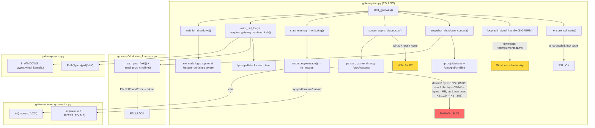
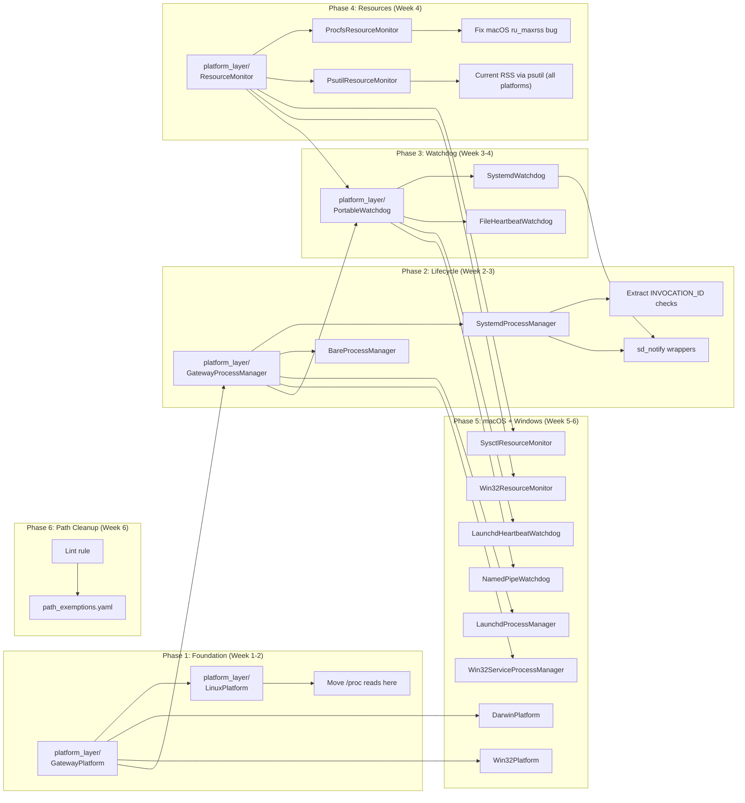
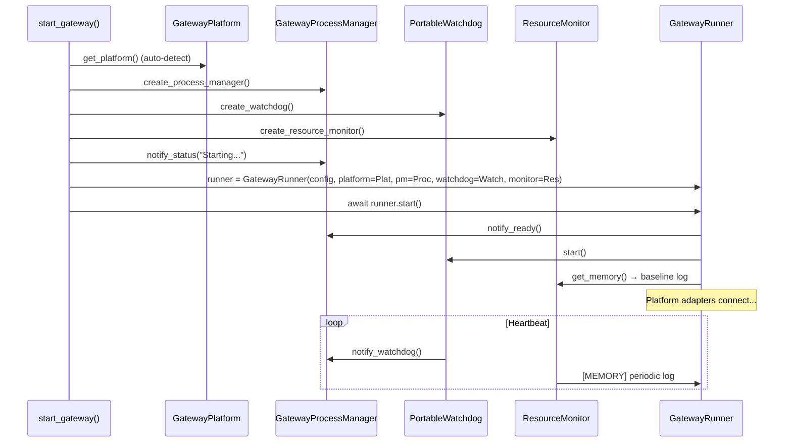
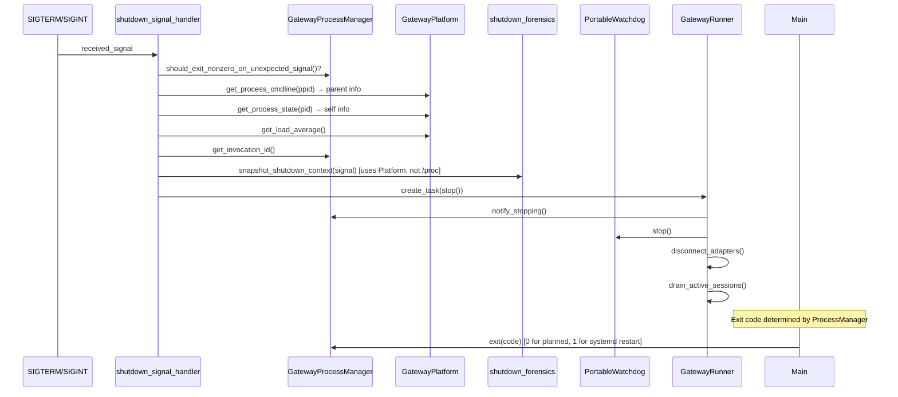

# Gateway Cross-Platform Resilience Layer — Architecture Design

**Author:** Rúnhild Svartdóttir (Architect, INTJ 5w6)
**Date:** 2026-05-16
**Status:** Design Phase — No Implementation
**Target:** Hermes Agent gateway — `gateway/run.py`, `gateway/shutdown_forensics.py`,
`gateway/status.py`, `gateway/memory_monitor.py`

---

## Table of Contents

1. [Motivation & Current State Assessment](#1-motivation--current-state-assessment)
2. [System 1: Platform Abstraction Layer (GatewayPlatform)](#2-system-1-platform-abstraction-layer-gatewayplatform)
3. [System 2: Process Lifecycle Abstraction (GatewayProcessManager)](#3-system-2-process-lifecycle-abstraction-gatewayprocessmanager)
4. [System 3: Portable Watchdog](#4-system-3-portable-watchdog)
5. [System 4: Portable Resource Monitoring](#5-system-4-portable-resource-monitoring)
6. [System 5: Absolute Path Cleanup & CI Enforcement](#5-system-5-absolute-path-cleanup--ci-enforcement)
7. [Integration Map & Migration Sequence](#6-integration-map--migration-sequence)
8. [Component Architecture (Mermaid)](#7-component-architecture-mermaid)
9. [Risk Register](#8-risk-register)

---

## 1. Motivation & Current State Assessment

### 1.1 The Problem

The Hermes Agent gateway was born on Linux under systemd. Over 44 releases,
OS-specific assumptions accreted in the core lifecycle code. Today the
gateway *does* run on macOS and Windows, but with degraded functionality:

| Concern | Linux | macOS | Windows |
|---------|-------|-------|---------|
| Signal handling | SIGTERM/SIGINT/SIGUSR1 via asyncio | Same (POSIX) | `NotImplementedError` — silently caught, no graceful shutdown |
| Process supervision | systemd `sd_notify`, `INVOCATION_ID`, `JOURNAL_STREAM` | None (launchd not integrated) | None (no Win32 service integration) |
| Shutdown forensics | `/proc/<pid>/status`, `/proc/<pid>/cmdline`, `/proc/self/cgroup`, `ps auxf`, `dmesg` | Partial (`/proc` paths fail → try/except pass → missing data) | `spawn_async_diagnostic` returns `None` on `win32` |
| PID lifecycle | `/proc/<pid>/stat` for start_time, `O_EXCL` pidfile, `fcntl.flock` | `/proc` fails → falls back to `ps -p <pid> -o command=` | `msvcrt.locking` (already handled), `ctypes` for `_pid_exists` |
| Resource monitoring | `resource.getrusage` (KB), `/proc/self/status` | `resource.getrusage` (bytes — **bug**: division by 1024² treats macOS bytes as KB) | `psutil` fallback only |
| SSL certs | 8 absolute paths scanned sequentially | Works (macOS paths included) | Python certifi fallback |
| Restart/watcher | `setsid bash -lc 'while kill -0...'` | Same | Inline Python watcher with `ctypes.windll` |

### 1.2 Guiding Principles

1. **No degradation on Linux.** The existing systemd integration must remain
   first-class; the new layer wraps it, not replaces it.
2. **Graceful fallback, not crash.** When an OS capability is missing (e.g.
   `/proc` on macOS, signals on Windows), return `None` or a no-op, never
   `NotImplementedError`.
3. **Unified shape, platform guts.** Every caller gets the same data shape
   regardless of OS. Platform-specific assembly happens in the implementation.
4. **Auto-detect, manual override.** Platform detection at import time via
   `sys.platform` + environment inspection. Allow `HERMES_PLATFORM_BACKEND`
   to force a specific implementation for testing.
5. **Testable in CI.** Every platform backend must be instantiable in CI
   (Linux runners) with mocked OS calls. The auto-detection path must be
   separable from the implementation.

### 1.3 Current Architecture (Pre-Refactor)



### 1.4 Target Architecture (Post-Refactor)

```mermaid
graph TD
    subgraph "Abstraction Layer (new module: gateway/platform_layer/)"
        PLATFORM["GatewayPlatform (ABC)"]
        LINUX["LinuxPlatform"]
        DARWIN["DarwinPlatform"]
        WIN32["Win32Platform"]
        PM["GatewayProcessManager (ABC)"]
        PM_LINUX["SystemdProcessManager"]
        PM_DARWIN["LaunchdProcessManager"]
        PM_WIN32["Win32ServiceProcessManager"]
        PM_BARE["BareProcessManager"]
        WATCHDOG["PortableWatchdog (ABC)"]
        WATCH_LINUX["SystemdWatchdog"]
        WATCH_DARWIN["LaunchdHeartbeatWatchdog"]
        WATCH_WIN32["NamedPipeWatchdog"]
        WATCH_BARE["FileHeartbeatWatchdog"]
        RES["ResourceMonitor (ABC)"]
        RES_LINUX["ProcfsResourceMonitor"]
        RES_DARWIN["SysctlResourceMonitor"]
        RES_WIN32["Win32ResourceMonitor"]
    end

    subgraph "Existing Code (no /proc, no systemd assumptions)"
        RUN["gateway/run.py"] --> PM
        RUN --> WATCHDOG
        RUN --> RES
        FORENSICS2["gateway/shutdown_forensics.py"] --> PLATFORM
        STATUS2["gateway/status.py"] --> PLATFORM
        MEM2["gateway/memory_monitor.py"] --> RES
    end

    AUTO["platform_layer/__init__.py"] --> |"auto-detect"| PLATFORM
    PLATFORM --> LINUX
    PLATFORM --> DARWIN
    PLATFORM --> WIN32
```



---

## 2. System 1: Platform Abstraction Layer (GatewayPlatform)

### 2.1 Interface Contract

```python
# Conceptual interface — not implementation code
class GatewayPlatform(ABC):
    """
    OS-level capabilities the gateway needs, abstracted behind a single
    auto-detected singleton.  No /proc, no systemd, no ctypes.windll
    anywhere outside the three implementations.
    """

    # -- Identification --------------------------------------------------
    @property
    def name(self) -> str:
        """'linux' | 'darwin' | 'win32'"""

    @property
    def is_posix(self) -> bool:
        """True for Linux and macOS."""

    # -- Process introspection -------------------------------------------
    def get_process_start_time(self, pid: int) -> Optional[int]:
        """
        Return kernel start time (clock ticks on Linux, seconds since
        boot on macOS, creation time as Unix timestamp on Windows).
        Returns None when the PID doesn't exist or the platform can't
        determine it.  Never raises.
        """

    def get_process_cmdline(self, pid: int) -> Optional[str]:
        """
        Return the command line of a process as a printable string.
        On Linux: reads /proc/<pid>/cmdline.
        On macOS: shells out to `ps -p <pid> -o command=`.
        On Windows: uses psutil.Process.cmdline().
        Returns None on failure.  Never raises.
        """

    def get_process_state(self, pid: int) -> Optional[str]:
        """
        Return a single-character process state ('R', 'S', 'D', 'T', 'Z'...).
        Linux: /proc/<pid>/status State field.
        macOS: ps -o state=.
        Windows: simplified mapping from thread/process status.
        Returns None on failure.
        """

    def pid_exists(self, pid: int) -> bool:
        """
        Cross-platform liveness check.  NEVER uses os.kill(pid, 0) on
        Windows (bpo-14484: generates Ctrl+C).  Each platform implements
        the safe equivalent.  Never raises.
        """

    # -- Filesystem locks ------------------------------------------------
    def acquire_file_lock(self, fd: int, *, shared: bool = False) -> bool:
        """
        Non-blocking file lock on an open file descriptor.
        POSIX: fcntl.flock(fd, LOCK_EX | LOCK_NB).
        Windows: msvcrt.locking(fd, LK_NBLCK, 1).
        Returns True on success, False if already held.
        """

    def release_file_lock(self, fd: int) -> None:
        """Release a previously acquired lock."""

    # -- Signal management -----------------------------------------------
    def install_signal_handler(
        self,
        sig: int,
        handler: Callable[..., Any],
        *,
        loop: Optional[AbstractEventLoop] = None,
    ) -> bool:
        """
        Install an asyncio-safe signal handler.  Returns True on success.
        On Windows: returns False for SIGTERM/SIGINT (not supported via
        add_signal_handler).  Callers must check the return value.
        """

    def get_signal_name(self, sig: int) -> str:
        """Human-readable signal name.  'SIGTERM', 'SIGINT', etc."""

    # -- System load -----------------------------------------------------
    def get_load_average(self) -> Optional[float]:
        """
        1-minute load average.  Linux/macOS: os.getloadavg()[0].
        Windows: returns None (no equivalent) or approximated via
        processor queue length.  Never raises.
        """

    # -- Child process spawning ------------------------------------------
    def detach_child_kwargs(self) -> Dict[str, Any]:
        """
        Return a dict of subprocess.Popen kwargs needed to detach a
        child from the parent's lifecycle.
        POSIX: {'start_new_session': True}.
        Windows: {'creationflags': DETACHED_PROCESS | CREATE_NEW_PROCESS_GROUP}.
        """

    def supports_subprocess_detach(self) -> bool:
        """True when the platform can truly detach a child (all except Emscripten, etc.)."""
```

### 2.2 Platform Implementations

#### LinuxPlatform

- `get_process_start_time`: Read `/proc/<pid>/stat`, parse field 22 (starttime in clock ticks since boot).
- `get_process_cmdline`: Read `/proc/<pid>/cmdline`, replace NUL with space.
- `get_process_state`: Read `/proc/<pid>/status`, extract `State:` line.
- `pid_exists`: `os.kill(pid, 0)` + catch `ProcessLookupError` / `PermissionError`. (Safe on Linux.)
- `acquire_file_lock`: `fcntl.flock(fd, LOCK_EX | LOCK_NB)`.
- `install_signal_handler`: `loop.add_signal_handler(sig, handler, sig)`. Supports SIGTERM, SIGINT, SIGHUP, SIGUSR1, SIGUSR2.
- `get_load_average`: `os.getloadavg()[0]`.
- `detach_child_kwargs`: `{'start_new_session': True, 'preexec_fn': os.setpgrp}`.

#### DarwinPlatform (macOS)

- `get_process_start_time`: `ps -p <pid> -o lstart=` parsed, or `sysctl kern.procargs`. Fallback: `proc_pidinfo` via ctypes if needed.
- `get_process_cmdline`: `ps -p <pid> -o command=` (already in `_read_process_cmdline` fallback).
- `get_process_state`: `ps -o state=`.
- `pid_exists`: `os.kill(pid, 0)` — safe on macOS (POSIX).
- `acquire_file_lock`: `fcntl.flock(fd, LOCK_EX | LOCK_NB)` — macOS supports flock since 10.6.
- `install_signal_handler`: Same as Linux (POSIX signals).
- `get_load_average`: `os.getloadavg()[0]`.
- `detach_child_kwargs`: `{'start_new_session': True}`.

Key difference from Linux: **no `/proc` filesystem access.** All process introspection goes through `ps` / `sysctl` / `proc_pidinfo`. This is slower (~50ms for `ps`) but reliable. Callers should not call these in hot loops.

#### Win32Platform (Windows)

- `get_process_start_time`: `psutil.Process(pid).create_time()` — psutil is already a dependency, used in the `_pid_exists` codepath.
- `get_process_cmdline`: `psutil.Process(pid).cmdline()`.
- `get_process_state`: Returns `"R"` (running) or `None` (terminated). Windows has no direct process-state equivalent; we use `WaitForSingleObject` with timeout 0 to distinguish running vs. exited.
- `pid_exists`: The existing ctypes-based `_pid_exists` win32 branch (unharmed, just relocated).
- `acquire_file_lock`: `msvcrt.locking(fd, LK_NBLCK, 1)` at offset `_WINDOWS_LOCK_OFFSET` (1MB). The existing `_IS_WINDOWS` guard in `_try_acquire_file_lock` moves here.
- `install_signal_handler`: **Always returns False.** On Windows, `add_signal_handler` raises `NotImplementedError` for all signals except `SIGINT` (which only works in the main thread of a console process). The existing `try/except NotImplementedError` guard in `start_gateway()` stays, but the `GatewayPlatform` call allows clean no-op behavior.
- `get_load_average`: Returns `None` — Windows has no direct load average.
- `detach_child_kwargs`: Returns `creationflags=DETACHED_PROCESS | CREATE_NEW_PROCESS_GROUP | CREATE_NO_WINDOW`.

### 2.3 Auto-Detection & Singleton

```python
# gateway/platform_layer/__init__.py — conceptual

_platform: Optional[GatewayPlatform] = None

def get_platform() -> GatewayPlatform:
    global _platform
    if _platform is None:
        override = os.environ.get("HERMES_PLATFORM_BACKEND")
        if override == "linux":
            _platform = LinuxPlatform()
        elif override == "darwin":
            _platform = DarwinPlatform()
        elif override == "win32":
            _platform = Win32Platform()
        elif sys.platform == "darwin":
            _platform = DarwinPlatform()
        elif sys.platform == "win32":
            _platform = Win32Platform()
        else:
            _platform = LinuxPlatform()  # default: most common deployment target
    return _platform
```

The `HERMES_PLATFORM_BACKEND` override exists for testing: CI (Linux runners)
can instantiate `DarwinPlatform` or `Win32Platform` with mocked OS calls to
verify interface compliance.

### 2.4 Integration Points in Existing Code

| Current Code Location | Current Pattern | New Pattern |
|----------------------|----------------|-------------|
| `shutdown_forensics.py:_read_proc_field()` | `open(f"/proc/{pid}/status")` | `platform.get_process_state(pid)` |
| `shutdown_forensics.py:_read_proc_cmdline()` | `open(f"/proc/{pid}/cmdline", "rb")` | `platform.get_process_cmdline(pid)` |
| `shutdown_forensics.py:snapshot_shutdown_context()` | `os.environ.get("INVOCATION_ID")`, `os.getloadavg()` | `process_manager.get_invocation_id()`, `platform.get_load_average()` |
| `status.py:_get_process_start_time()` | `Path(f"/proc/{pid}/stat").read_text()` | `platform.get_process_start_time(pid)` |
| `status.py:_read_process_cmdline()` | `Path(f"/proc/{pid}/cmdline").read_bytes()` | `platform.get_process_cmdline(pid)` |
| `status.py:_pid_exists()` | Inline ctypes + psutil + os.kill | `platform.pid_exists(pid)` |
| `status.py:_try_acquire_file_lock()` | Inline `msvcrt.locking` / `fcntl.flock` | `platform.acquire_file_lock(fd)` |
| `run.py:start_gateway()` signal handlers | `loop.add_signal_handler(sig, ...)` in try/except | `platform.install_signal_handler(sig, handler, loop=loop)` |

### 2.5 Migration Path

**Phase 1:** Create `gateway/platform_layer/` with the ABC and LinuxPlatform.
Make LinuxPlatform a passthrough to the existing code paths — zero behavioral change.
**Phase 2:** Add DarwinPlatform and Win32Platform behind `HERMES_PLATFORM_BACKEND`
override. Test on real macOS and Windows hardware.
**Phase 3:** Move existing callers one-by-one from direct `/proc` access to
`get_platform()`. Each migration is a single-line change with a fallback for
safety.
**Phase 4:** Remove the old inline implementations (the `_read_proc_field` in
shutdown_forensics, the `/proc/pid/stat` read in status.py) once all callers
are migrated.

---

## 3. System 2: Process Lifecycle Abstraction (GatewayProcessManager)

### 3.1 Interface Contract

```python
class GatewayProcessManager(ABC):
    """
    Abstracts communication with the service supervisor (systemd, launchd,
    Win32 SCM, or nothing for bare processes).

    Every method is a no-op on unsupported platforms — never raises,
    never crashes the gateway.
    """

    def notify_ready(self) -> None:
        """
        Signal the service manager that the gateway has finished startup
        and is ready to accept work.
        systemd: sd_notify(0, "READY=1")
        launchd: (handled by KeepAlive plist, no-op at runtime)
        Win32: SetServiceStatus(SERVICE_RUNNING)
        bare: no-op
        """

    def notify_stopping(self) -> None:
        """
        Signal that the gateway is beginning shutdown.
        systemd: sd_notify(0, "STOPPING=1")
        launchd: no-op
        Win32: SetServiceStatus(SERVICE_STOP_PENDING)
        bare: no-op
        """

    def notify_watchdog(self) -> None:
        """
        Ping the supervisor's watchdog timer.  Must be called at least
        every (WatchdogSec / 2) seconds or the supervisor kills us.
        systemd: sd_notify(0, "WATCHDOG=1")
        launchd: no-op (launchd uses KeepAlive, not interval pings)
        Win32: no-op (watchdog is separate — see System 3)
        bare: no-op
        """

    def notify_status(self, status: str) -> None:
        """
        Free-form status string for the supervisor.
        systemd: sd_notify(0, f"STATUS={status}")
        Others: no-op
        """

    def get_invocation_id(self) -> Optional[str]:
        """
        Return a unique identifier for this process invocation.
        systemd: $INVOCATION_ID (UUID)
        launchd: $LAUNCHD_JOB_INSTANCE_ID or generated UUID
        bare: generated UUID at startup
        Win32: generated UUID at startup
        """

    def get_service_name(self) -> Optional[str]:
        """
        The name of the service/unit/job this process is running under.
        systemd: read /proc/self/cgroup, extract .service suffix
        launchd: $LAUNCHD_JOB_NAME or from plist
        others: None
        """

    def restart_via_service(self) -> bool:
        """
        Request that the service manager restart this process after exit.
        systemd: exit with code 75 (EX_TEMPFAIL — Restart=on-failure)
        launchd: exit with code 0 (launchd KeepAlive restarts on any exit)
        Win32: exit with SCM restart code
        bare: returns False (can't restart — caller must use detached method)
        """

    def should_exit_nonzero_on_unexpected_signal(self) -> bool:
        """
        Whether an unexpected SIGTERM should produce a non-zero exit code.
        systemd: True (Restart=on-failure needs exit != 0)
        launchd: False (KeepAlive restarts on any exit)
        bare/Win32: False
        """

    @property
    def is_managed(self) -> bool:
        """True when running under a service supervisor (not a bare process)."""
```

### 3.2 Platform Implementations

#### SystemdProcessManager (Linux)

All `notify_*` methods use `sd_notify(0, ...)` via ctypes or the `sdnotify`
PyPI package (stdlib `socket` + `os.environ.get("NOTIFY_SOCKET")`). This
replaces the scattered `INVOCATION_ID` checks currently in `run.py` lines
8956-8965 and `shutdown_forensics.py` lines 134-143.

Detection: `os.environ.get("NOTIFY_SOCKET") is not None` and/or
`os.environ.get("INVOCATION_ID") is not None`.

`get_service_name()` reads `/proc/self/cgroup`, same as existing
`check_systemd_timing_alignment()` in shutdown_forensics.py.

`restart_via_service()` returns `True` and the caller exits with code 75
(EX_TEMPFAIL). This is the existing `via_service=True` path in
`request_restart()`.

#### LaunchdProcessManager (macOS)

Detection: `os.environ.get("LAUNCHD_SOCKET")` or plist-based detection.

`notify_ready()` and `notify_stopping()` are no-ops (launchd manages state
via the KeepAlive plist key, not runtime notifications).

`get_invocation_id()` uses `os.environ.get("XPC_SERVICE_INSTANCE_ID")` or a
generated UUID.

`restart_via_service()` returns `True`; exit with 0 (launchd restarts any
exit when KeepAlive is set).

#### Win32ServiceProcessManager (Windows)

Detection: `os.environ.get("HERMES_RUNNING_AS_SERVICE")` or Win32 API check.

`notify_ready()` calls `SetServiceStatus(SERVICE_RUNNING)` via ctypes.

`restart_via_service()` sets a service exit code indicating restart-needed
(analogous to systemd exit 75 pattern).

#### BareProcessManager (fallback for bare terminal / cron / Docker)

All `notify_*` methods are no-ops. `is_managed` returns `False`.

`get_invocation_id()` generates a UUID at construction time.

`restart_via_service()` returns `False`.

### 3.3 Integration Points

| Current Code (run.py) | New Pattern |
|----------------------|-------------|
| Line 8956-8965: `/restart` checks `INVOCATION_ID` to route `via_service=True` | `process_manager.is_managed` → route restart |
| Lines 16854-16865: Signal handler exit-code logic based on planned_takeover | `process_manager.should_exit_nonzero_on_unexpected_signal()` |
| Lines 17059-17072: Exit with code 1 for systemd Restart=on-failure | `process_manager.should_exit_nonzero_on_unexpected_signal()` |
| Line 137: `os.environ.get("INVOCATION_ID")` in shutdown_forensics | `process_manager.get_invocation_id()` |
| `check_systemd_timing_alignment()` (entire function) | Move into SystemdProcessManager as `check_timing_alignment(drain_timeout)` |

### 3.4 Migration Path

**Phase 1:** Create `GatewayProcessManager` ABC and `BareProcessManager`
(inert, all no-ops). Wire into `start_gateway()` via a keyword argument
defaulting to `BareProcessManager()`. Zero behavioral change.

**Phase 2:** Add `SystemdProcessManager` with `sd_notify` and `INVOCATION_ID`
logic extracted from shutdown_forensics.py. Gate behind `NOTIFY_SOCKET` env
check.

**Phase 3:** Add `LaunchdProcessManager` and `Win32ServiceProcessManager`.

**Phase 4:** Remove `INVOCATION_ID` and `JOURNAL_STREAM` checks from
shutdown_forensics.py; they come from `process_manager` now.

---

## 4. System 3: Portable Watchdog

### 4.1 Interface Contract

```python
class PortableWatchdog(ABC):
    """
    Ensures the gateway process is alive and responsive.  When the
    watchdog detects a hung gateway, it triggers a restart through
    the service manager or an external watcher.
    """

    def start(self) -> None:
        """Start the watchdog mechanism.  Idempotent."""

    def stop(self) -> None:
        """Stop the watchdog.  Called during graceful shutdown."""

    def heartbeat(self) -> None:
        """
        Signal that the gateway is alive.  Must be called periodically
        (every <interval> seconds).  If the gateway stops calling this,
        the watchdog triggers recovery.
        """

    @property
    def interval_seconds(self) -> float:
        """How often heartbeat() must be called (seconds)."""

    @property
    def is_active(self) -> bool:
        """True when the watchdog is running."""

    @property
    def missed_heartbeats(self) -> int:
        """Number of consecutive missed heartbeat intervals (for monitoring)."""
```

### 4.2 Platform Implementations

#### SystemdWatchdog (Linux)

Relies on systemd's built-in watchdog mechanism. The systemd unit file
sets `WatchdogSec=60`. The gateway calls `sd_notify(0, "WATCHDOG=1")`
every 30 seconds (WatchdogSec/2). If the gateway hangs for >60s, systemd
kills it with `SIGABRT` and restarts it (Restart=on-failure).

Integration with `GatewayProcessManager`: `process_manager.notify_watchdog()`
is the actual heartbeat call.

Detection: `os.environ.get("WATCHDOG_USEC") is not None` and `WATCHDOG_USEC > 0`.

#### LaunchdHeartbeatWatchdog (macOS)

launchd uses `KeepAlive` plist keys, not interval pings. On macOS, the
watchdog is **file-based**: the gateway writes a timestamp to
`{HERMES_HOME}/.gateway-heartbeat` every N seconds. An external watcher
(`hermes watchdog` spawned by the user's launchd plist or a cron job)
reads this file. If the timestamp is older than 2× the interval, the
external watcher kills the gateway and launchd restarts it.

The external watcher is a separate subprocess launched by the
`LaunchdProcessManager` at startup time, or runs as a `cron` job.

#### NamedPipeWatchdog (Windows)

On Windows, a **watchdog thread** writes heartbeats to a named pipe.
An external watcher process (registered as a Windows scheduled task)
reads the pipe. If the pipe goes silent, the watcher task kills the
gateway via `taskkill /F` and the Windows service manager (or scheduled
task) restarts it.

Alternatively: a simple watchdog thread inside the gateway that checks a
`threading.Event` set by the main loop. If the event is not set within
`interval_seconds`, the thread calls `os._exit(1)` (hard exit — no
atexit handlers, no cleanup, just die). This is crude but effective on
Windows where external watchdogs are harder to configure.

#### FileHeartbeatWatchdog (bare process — fallback)

Writes a timestamp to `{HERMES_HOME}/.gateway-heartbeat` every N seconds.
An external cron job (Linux/macOS) or scheduled task (Windows) checks
staleness. This is the most portable option and the default when no
service manager is detected.

### 4.3 Integration Points

| Current Code | New Pattern |
|-------------|-------------|
| `GatewayRunner._start_watchdog_keepalive()` (if it exists) | `watchdog.start()` during `runner.start()` |
| `GatewayRunner.stop()` | `watchdog.stop()` before adapter teardown |
| (none — currently no heartbeat loop) | `watchdog.heartbeat()` called from the asyncio event loop every `interval_seconds / 2` |

### 4.4 Migration Path

This is largely **new functionality** — the gateway currently doesn't have a
built-in watchdog. The migration adds it incrementally:

**Phase 1:** Add `PortableWatchdog` ABC and `FileHeartbeatWatchdog` (no service
manager dependency). Wire `heartbeat()` into the main event loop with a
`asyncio.create_task`. Test that heartbeat timestamps are written.

**Phase 2:** Add `SystemdWatchdog` for the `WATCHDOG_USEC` env var path. This
is the highest-value implementation since most production deployments use
systemd.

**Phase 3:** Add `LaunchdHeartbeatWatchdog` and `NamedPipeWatchdog` for macOS
and Windows parity.

---

## 5. System 4: Portable Resource Monitoring

### 5.1 Interface Contract

```python
@dataclass
class MemoryInfo:
    """Unified memory snapshot across all platforms."""
    rss_mb: int              # Resident set size in MB (current, not peak)
    vms_mb: Optional[int]    # Virtual memory size in MB (None if unavailable)
    peak_rss_mb: Optional[int]  # Peak RSS this process ever used (None if unavailable)
    available: bool          # False when no memory API worked

@dataclass
class FDInfo:
    """Unified file descriptor / handle count."""
    count: Optional[int]     # Open FDs (Linux/macOS) or handles (Windows)
    limit_soft: Optional[int]  # Soft limit (ulimit -n)
    limit_hard: Optional[int]  # Hard limit
    available: bool

class ResourceMonitor(ABC):
    """Cross-platform resource introspection.  Never raises."""

    def get_memory(self) -> MemoryInfo:
        """Current process memory usage."""

    def get_fd_count(self) -> FDInfo:
        """Open file descriptors / handles."""

    def get_thread_count(self) -> int:
        """Number of threads in this process (from threading.active_count)."""
```

### 5.2 Platform Implementations

#### ProcfsResourceMonitor (Linux)

- **Memory current RSS:** `resource.getrusage(RUSAGE_SELF).ru_maxrss`. On
  Linux this is in **kilobytes**. Divide by 1024 for MB. **Note:** `ru_maxrss`
  on Linux is the *high-water mark* (peak), not current RSS. For current
  RSS, read `/proc/self/status` field `VmRSS` (also in KB).
- **Memory peak RSS:** `ru_maxrss / 1024` (MB) — this IS the peak on Linux.
- **Memory VMS:** `/proc/self/status` field `VmSize` (KB → MB).
- **FD count:** `len(os.listdir('/proc/self/fd'))`.
- **FD limits:** `resource.getrlimit(resource.RLIMIT_NOFILE)`.

**Design decision:** Use `/proc/self/status` for current RSS (accurate at
moment of read) and `ru_maxrss` for peak (tracked by kernel). The dual
read costs ~2ms total — negligible for a periodic monitor.

#### SysctlResourceMonitor (macOS / Darwin)

- **Memory current RSS:** `psutil.Process().memory_info().rss` (bytes → MB).
  Do NOT use `resource.getrusage().ru_maxrss` — on macOS it's in **bytes**
  (not KB!), and it's the **peak** high-water mark, not current RSS.
  **BUG FIX:** The current `memory_monitor.py` line 66-67 does:
  ```python
  if sys.platform == "darwin":
      return int(maxrss / _BYTES_TO_MB)  # _BYTES_TO_MB = 1024*1024
  ```
  While this is technically correct for macOS (where `ru_maxrss` is bytes),
  it reports **peak RSS**, not current RSS. For leak detection, we need
  current RSS. Replace with `psutil.Process().memory_info().rss` which
  returns current RSS in bytes on all platforms.
- **Memory peak RSS:** `resource.getrusage(RUSAGE_SELF).ru_maxrss`. On macOS,
  divide by (1024 * 1024) for MB — this IS bytes.
- **Memory VMS:** `psutil.Process().memory_info().vms` (bytes → MB).
- **FD count:** `len(os.listdir('/dev/fd'))` + fallback to `lsof -p <pid>`
  if `/dev/fd` doesn't exist (some macOS versions). Parsing `lsof` is slow
  (~200ms) so this is read-on-demand, not per-heartbeat.
- **FD limits:** `resource.getrlimit(resource.RLIMIT_NOFILE)` — works on macOS.

#### Win32ResourceMonitor (Windows)

- **Memory current RSS:** `psutil.Process().memory_info().rss` (bytes → MB).
- **Memory peak RSS:** `psutil.Process().memory_info().peak_wset` (bytes → MB).
  This is the "peak working set" — closest Windows equivalent to peak RSS.
- **Memory VMS:** `psutil.Process().memory_info().vms` (bytes → MB).
- **FD count:** `psutil.Process().num_handles()` — returns handle count, not
  POSIX FD count. Close enough for leak detection.
- **FD limits:** Windows has no rlimit equivalent. Returns `limit_soft=None`,
  `limit_hard=None`.

### 5.3 The macOS `ru_maxrss` Bug — Detailed Analysis

Current code in `gateway/memory_monitor.py:52-69`:

```python
# Line 58-59 (comment): "On Linux ru_maxrss is in KB, on macOS it is in bytes"
# Line 60-61 (comment): "ru_maxrss reports the high-water mark for the process"
# Line 65: maxrss = resource.getrusage(resource.RUSAGE_SELF).ru_maxrss
# Line 66-67:
if sys.platform == "darwin":
    return int(maxrss / _BYTES_TO_MB)   # 1024*1024 → bytes to MB ✓
# Line 69:
return int(maxrss / 1024)               # KB to MB ✓ (Linux)
```

**The real bugs:**

1. **Peak vs current.** `ru_maxrss` is the peak (high-water mark), not the
   current RSS. For leak detection, current RSS is far more useful — it
   shows whether memory is being *released*. Peak only goes up.
   - On Linux: read `/proc/self/status` `VmRSS` for current; use `ru_maxrss` for peak.
   - On macOS: use `psutil.Process().memory_info().rss` for current.
   - On Windows: use `psutil.Process().memory_info().rss` for current.

2. **The bytes/KB doc is correct but the code is misleading.** The comment
   says macOS is bytes and the division uses `_BYTES_TO_MB` (correct),
   but the code structure implies "macOS does something special" when in
   fact the logic is sound. The real issue is that on macOS, `ru_maxrss`
   is peak and in bytes — correct division but wrong metric for monitoring.

**Fix strategy:**
- Add `current_rss_mb` and `peak_rss_mb` as separate fields in `MemoryInfo`.
- `current_rss_mb`: always from `psutil` (current RSS, uniform across all 3 platforms).
- `peak_rss_mb`: from `ru_maxrss` on Linux/macOS (with correct division),
  from `peak_wset` on Windows.
- Fallback chain: psutil → resource → None.

### 5.4 Integration Points

| Current Code | New Pattern |
|-------------|-------------|
| `memory_monitor.py:_get_rss_mb()` — the entire function | `monitor.get_memory().rss_mb` |
| `memory_monitor.py:start_memory_monitoring()` — RSS availability check | `monitor.get_memory().available` |
| `memory_monitor.py:log_memory_usage()` — `gc.get_count()` + `threading.active_count()` | `ResourceMonitor.get_thread_count()` |
| (none — FD monitoring is new) | `monitor.get_fd_count()` for periodic FD leak detection |

### 5.5 Migration Path

**Phase 1:** Create `ResourceMonitor` ABC, `MemoryInfo`, `FDInfo` dataclasses.
Implement `ProcfsResourceMonitor` as a drop-in replacement for the existing
`_get_rss_mb()` logic with the dual current/peak distinction.

**Phase 2:** Add `SysctlResourceMonitor` and `Win32ResourceMonitor`. Gate
behind `HERMES_PLATFORM_BACKEND`.

**Phase 3:** Add FD monitoring as a new periodic log line:
`[RESOURCE] fds=42/1024 threads=8`. This is new telemetry that helps
diagnose connection leaks.

**Phase 4:** Remove the now-redundant `sys.platform == "darwin"` branch from
`_get_rss_mb()`. The platform detection is in `ResourceMonitor` construction,
not in every measurement call.

---

## 6. System 5: Absolute Path Cleanup & CI Enforcement

### 6.1 Audit of Absolute Paths (Cartographer Finding: ~27)

#### Category A: SSL Certificate Paths (ACCEPTABLE — 8 paths)

Located in `gateway/run.py:_ensure_ssl_certs()`, lines 330-338:

```
/etc/ssl/certs/ca-certificates.crt         # Debian/Ubuntu/Gentoo
/etc/pki/tls/certs/ca-bundle.crt           # RHEL/CentOS 7
/etc/pki/ca-trust/extracted/pem/tls-ca-bundle.pem  # RHEL/CentOS 8+
/etc/ssl/ca-bundle.pem                     # SUSE/OpenSUSE
/etc/ssl/cert.pem                          # Alpine / macOS
/etc/pki/tls/cert.pem                      # Fedora
/usr/local/etc/openssl@1.1/cert.pem        # macOS Homebrew Intel
/opt/homebrew/etc/openssl@1.1/cert.pem     # macOS Homebrew ARM
```

**Verdict: KEEP AS-IS.** These are intentionally hardcoded because:
- They MUST work before any library (including `certifi`) is imported.
- They are discovery paths, not configuration — the function checks
  `ssl.get_default_verify_paths()` first (Python's built-in knowledge),
  then `certifi.where()`, and only then these hardcoded paths as a
  last resort.
- They are additive (non-destructive) — if none exist, `SSL_CERT_FILE`
  remains unset and the caller handles it.
- Adding them to a config file would create a chicken-and-egg problem:
  you need SSL to download configs/plugins.

Document as "SSL bootstrap paths — intentionally hardcoded for early
initialization safety."

#### Category B: /proc Filesystem Paths (REPLACE — 6 paths)

| Location | Path | Replacement |
|----------|------|-------------|
| `shutdown_forensics.py:51` | `f"/proc/{pid}/status"` | `platform.get_process_state(pid)` + `platform.get_process_memory(pid)` |
| `shutdown_forensics.py:63` | `f"/proc/{pid}/cmdline"` | `platform.get_process_cmdline(pid)` |
| `shutdown_forensics.py:347` | `"/proc/self/cgroup"` | `process_manager.get_service_name()` (System 2) |
| `status.py:113` | `f"/proc/{pid}/stat"` | `platform.get_process_start_time(pid)` (System 1) |
| `status.py:133` | `f"/proc/{pid}/cmdline"` | `platform.get_process_cmdline(pid)` (System 1) |
| `status.py:647` | `f"/proc/{existing_pid}/status"` | `platform.get_process_state(existing_pid)` (System 1) |

All replaced by System 1 (GatewayPlatform) or System 2 (GatewayProcessManager).

#### Category C: Shared Library Paths (DOCUMENT — 2 paths)

Located in `gateway/platforms/discord.py:611-612`:
```
/opt/homebrew/lib/libopus.dylib   # Apple Silicon
/usr/local/lib/libopus.dylib      # Intel Mac
```

These are shared-library discovery paths for Discord voice support (Opus codec).
They follow the same pattern as SSL certs — hardcoded discovery paths that
don't ship with the OS. Keep them but document in a centralized
`PLATFORM_SPECIFIC_PATHS.md` so future maintainers know they exist.

#### Category D: Non-Existent /home/pi Paths (GOOD — 0 paths)

Cartographer confirms: **no absolute `/home/pi` paths exist** in the codebase.
`HERMES_HOME` and `get_hermes_home()` are used correctly throughout.

### 6.2 CI Enforcement

**Lint rule:** Add a custom rule to the project's linting pipeline (flake8
plugin or ruff AST check) that flags new absolute paths in `gateway/`,
`hermes_cli/`, and `agent/`. The rule:

```
FORBIDDEN_ABSOLUTE_PATHS = [
    "/etc/ssl/certs/", "/etc/pki/",     # SSL paths — exempt list
    "/proc/",                            # FLAGGED — must use GatewayPlatform
    "/sys/",                             # FLAGGED
    "/dev/",                             # Reviewed case-by-case
    "/home/", "/root/",                  # FLAGGED — must use HERMES_HOME
    "/tmp/",                             # FLAGGED — must use tempfile.gettempdir()
    "/usr/local/lib/", "/opt/homebrew/", # EXEMPT: shared library discovery
]
```

Exceptions are maintained in a YAML file at `gateway/platform_layer/path_exemptions.yaml`:

```yaml
# Paths exempt from the "no absolute paths" lint rule.
# Each entry must include a rationale and be reviewed during PR.
exemptions:
  - pattern: "/etc/ssl/"
    rationale: "SSL CA bundle discovery — must work before any library imports"
    locations: ["gateway/run.py"]
  - pattern: "/opt/homebrew/lib/libopus.dylib"
    rationale: "Opus codec discovery for Discord voice on macOS ARM"
    locations: ["gateway/platforms/discord.py"]
  - pattern: "/usr/local/lib/libopus.dylib"
    rationale: "Opus codec discovery for Discord voice on macOS Intel"
    locations: ["gateway/platforms/discord.py"]
```

### 6.3 Migration Path

**Phase 1:** Create `path_exemptions.yaml` with the SSL and Opus paths documented.

**Phase 2:** Add the lint rule (non-blocking warning initially). Run it in CI
to establish the baseline.

**Phase 3:** Replace all `/proc` paths with `GatewayPlatform` calls (part of
Systems 1-2 migration).

**Phase 4:** Upgrade the lint rule to blocking (error) once all existing
violations are resolved.

---

## 7. Integration Map & Migration Sequence

### 7.1 Dependency Graph



### 7.2 Migration Sequence

| Phase | Deliverable | Risk | Rollback |
|-------|------------|------|----------|
| 1 | `gateway/platform_layer/` module skeleton + `LinuxPlatform` | Low — passthrough to existing code | Delete module |
| 2 | `GatewayProcessManager` + `SystemdProcessManager` + `BareProcessManager` | Medium — touches signal handler and exit code logic | Revert to inline checks |
| 3 | `PortableWatchdog` + `SystemdWatchdog` + `FileHeartbeatWatchdog` | Low — new functionality, off by default | Disable via config |
| 4 | `ResourceMonitor` + fix macOS bug | Low — drop-in for `_get_rss_mb()` | Revert function |
| 5 | `DarwinPlatform`, `Win32Platform`, `LaunchdProcessManager`, `Win32ServiceProcessManager` | Medium — needs real macOS/Windows testing | Gate behind `HERMES_PLATFORM_BACKEND` |
| 6 | Lint rule + path audit | Low — non-blocking initially | Disable lint rule |

### 7.3 File Structure (Target)

```
gateway/
├── platform_layer/
│   ├── __init__.py              # auto-detect + get_platform()
│   ├── platform.py              # GatewayPlatform ABC + MemoryInfo/FDInfo dataclasses
│   ├── platform_linux.py        # LinuxPlatform
│   ├── platform_darwin.py       # DarwinPlatform
│   ├── platform_win32.py        # Win32Platform
│   ├── process_manager.py       # GatewayProcessManager ABC
│   ├── process_manager_systemd.py    # SystemdProcessManager
│   ├── process_manager_launchd.py    # LaunchdProcessManager
│   ├── process_manager_win32.py      # Win32ServiceProcessManager
│   ├── process_manager_bare.py       # BareProcessManager
│   ├── watchdog.py              # PortableWatchdog ABC
│   ├── watchdog_systemd.py      # SystemdWatchdog
│   ├── watchdog_heartbeat.py    # FileHeartbeatWatchdog + LaunchdHeartbeatWatchdog
│   ├── watchdog_named_pipe.py   # NamedPipeWatchdog (Windows)
│   ├── resource_monitor.py      # ResourceMonitor ABC + Factory
│   ├── resource_procfs.py       # ProcfsResourceMonitor (Linux)
│   ├── resource_darwin.py       # SysctlResourceMonitor (macOS)
│   ├── resource_win32.py        # Win32ResourceMonitor
│   └── path_exemptions.yaml     # Absolute path allowlist for CI
├── run.py                       # ← imports from platform_layer
├── shutdown_forensics.py        # ← uses GatewayPlatform, not /proc
├── status.py                    # ← uses GatewayPlatform, not /proc
└── memory_monitor.py            # ← uses ResourceMonitor, not getrusage directly
```

---

## 8. Component Architecture (Mermaid)

### 8.1 Full Component Diagram

```mermaid
graph TB
    subgraph "Entry Point"
        START["start_gateway() in gateway/run.py"]
    end

    subgraph "Platform Abstraction Layer"
        GP["GatewayPlatform (singleton)"]
        GP --> LIN["LinuxPlatform<br/>─ /proc reads<br/>─ fcntl.flock<br/>─ os.kill(pid,0)"]
        GP --> DAR["DarwinPlatform<br/>─ ps/sysctl<br/>─ fcntl.flock<br/>─ os.kill(pid,0)"]
        GP --> WIN["Win32Platform<br/>─ psutil<br/>─ msvcrt.locking<br/>─ ctypes WaitForSingleObject"]
    end

    subgraph "Process Lifecycle"
        PM["GatewayProcessManager"]
        PM --> PM_SD["SystemdProcessManager<br/>─ sd_notify<br/>─ INVOCATION_ID<br/>─ exit code 75"]
        PM --> PM_LD["LaunchdProcessManager<br/>─ no-op notifications<br/>─ KeepAlive support"]
        PM --> PM_WS["Win32ServiceProcessManager<br/>─ SetServiceStatus<br/>─ SCM restart codes"]
        PM --> PM_BARE["BareProcessManager<br/>─ all no-ops<br/>─ generated UUID"]
    end

    subgraph "Watchdog"
        WD["PortableWatchdog"]
        WD --> WD_SD["SystemdWatchdog<br/>─ WATCHDOG_USEC<br/>─ sd_notify WATCHDOG=1"]
        WD --> WD_FH["FileHeartbeatWatchdog<br/>─ .gateway-heartbeat<br/>─ cron/external watcher"]
        WD --> WD_NP["NamedPipeWatchdog<br/>─ named pipe<br/>─ watchdog thread"]
    end

    subgraph "Resource Monitoring"
        RM["ResourceMonitor"]
        RM --> RM_LIN["ProcfsResourceMonitor<br/>─ /proc/self/status<br/>─ /proc/self/fd<br/>─ ru_maxrss (KB)"]
        RM --> RM_DAR["SysctlResourceMonitor<br/>─ psutil memory_info<br/>─ lsof / /dev/fd<br/>─ ru_maxrss (bytes)"]
        RM --> RM_WIN["Win32ResourceMonitor<br/>─ psutil memory_info<br/>─ num_handles()<br/>─ peak_wset"]
    end

    subgraph "Existing Gateway Code"
        RUN["gateway/run.py<br/>GatewayRunner"]
        SF["gateway/shutdown_forensics.py"]
        ST["gateway/status.py<br/>PID file + locks"]
        MM["gateway/memory_monitor.py<br/>periodic RSS logging"]
    end

    START --> GP
    START --> PM
    START --> WD
    RUN --> PM
    RUN --> WD
    RUN --> RM
    SF --> GP
    SF --> PM
    ST --> GP
    MM --> RM
    WD --> PM
```



### 8.2 Startup Sequence



### 8.3 Shutdown Sequence



---

## 9. Risk Register

| # | Risk | Likelihood | Impact | Mitigation |
|---|------|-----------|--------|------------|
| R1 | `psutil` not installed on user systems | Low (it's in requirements.txt) | Medium | `ResourceMonitor` and `Win32Platform` degrade gracefully — return `available=False` in data shapes |
| R2 | `sd_notify` writes to wrong socket under user/system systemd | Low | High | Read `NOTIFY_SOCKET` env var (set by systemd); never guess the socket path |
| R3 | macOS `lsof` is slow (~200ms) when called per-heartbeat | Medium | Low | FD count is read only at startup + shutdown, not per heartbeat; use `/dev/fd` first |
| R4 | Windows named pipe permissions prevent watcher from connecting | Medium | Medium | Fall back to internal watchdog thread with `os._exit(1)` — simpler, always works |
| R5 | Platform auto-detection misidentifies WSL2 as Linux (it is, but systemd may not be available) | Medium | Low | `SystemdProcessManager` gates on `NOTIFY_SOCKET`, not `sys.platform`; auto-falls to `BareProcessManager` |
| R6 | New lint rule breaks CI for PRs touching SSL path files | High (temporary) | Low | Start with warning-only; only go blocking after baseline is clean |
| R7 | `getrusage()` behavior changes in future Python/macOS versions | Low | High | `ResourceMonitor` has fallback chain: psutil → resource → None. Dual-pathing protects against single-API breakage |
| R8 | Docker container detection (TERMINAL_ENV=docker) interacts with platform detection | Low | Medium | Platform auto-detection runs independently; Docker is a terminal backend concern, not a platform concern |

---

## Appendix A: Key Design Decisions Log

| # | Decision | Rationale | Alternatives Considered |
|---|---------|-----------|------------------------|
| D1 | Use ABCs, not protocols | Need `isinstance` checks for testing + runtime dispatch; protocols are static-only | `typing.Protocol` — rejected, no runtime dispatch |
| D2 | Singleton pattern for GatewayPlatform | One platform per process; avoids passing `platform` through every constructor | Dependency injection — rejected, too much plumbing |
| D3 | `psutil` as soft dependency | Already in requirements.txt; used in 3 places today; best cross-platform proc API | Pure stdlib — rejected, too much ctypes per platform |
| D4 | `sd_notify` via ctypes, not sdnotify PyPI | Avoid adding a dependency for 4 function calls; systemd socket protocol is trivial | sdnotify package — adds dep for minor convenience |
| D5 | `ru_maxrss` kept but `psutil` preferred for current RSS | `ru_maxrss` is peak on all platforms; `psutil` gives current RSS uniformly | Drop `resource` entirely — rejected, it's stdlib and useful for peak tracking |
| D6 | Platform implementations in separate files | 17k LOC run.py is already too large; platform code should not add to it | Single `platforms.py` — rejected, each platform is ~150 LOC, worth separating |

---

## Appendix B: Test Strategy

| Layer | Test Type | What It Verifies |
|-------|----------|-----------------|
| `GatewayPlatform` impls | Unit (Linux CI) | Each method returns correct shape; `/proc` mocks simulate missing fs |
| `GatewayProcessManager` impls | Unit + Integration | `sd_notify` message format; exit code logic under signal scenarios |
| `PortableWatchdog` | Unit | Heartbeat file format; stale detection math |
| `ResourceMonitor` impls | Unit + Cross-platform CI | `MemoryInfo` shape identical across platforms; macOS bytes/KB bug fix verified |
| `path_exemptions.yaml` lint | Static analysis + CI | New PRs without `/proc` or `/home/*` patterns; exempted paths documented |

**Cross-platform CI matrix:**

| Runner | `sys.platform` | `HERMES_PLATFORM_BACKEND` | What's tested |
|--------|---------------|--------------------------|---------------|
| ubuntu-latest | `linux` | (auto) | LinuxPlatform + SystemdProcessManager (real) |
| ubuntu-latest | `linux` | `darwin` | DarwinPlatform (mocked /proc absence, real `ps`) |
| ubuntu-latest | `linux` | `win32` | Win32Platform (mocked ctypes, real psutil) |
| macos-latest | `darwin` | (auto) | DarwinPlatform (real sysctl/ps) |
| windows-latest | `win32` | (auto) | Win32Platform (real ctypes/psutil) |

---

*End of architecture document. This is a design artifact — no code has been
written. All interface contracts above are conceptual and subject to change
during implementation.*
