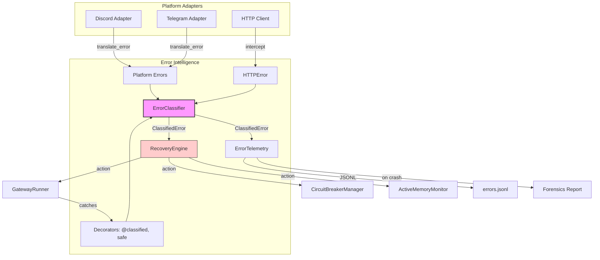

# Gateway Error Intelligence Layer — Architecture Design

**Author:** Rúnhild Svartdóttir (Architect, INTJ 5w6)  
**Date:** 2026-05-16  
**Status:** Design Phase — No Implementation  
**Target:** Hermes Agent gateway — `gateway/run.py`, `gateway/platforms/`, `gateway/session.py`

---

## Table of Contents

1. [Motivation & Current State Assessment](#1-motivation--current-state-assessment)
2. [System 1: ErrorClassifier Taxonomy](#2-system-1-errorclassifier-taxonomy)
3. [System 2: Structured Exception Handling Protocol](#3-system-2-structured-exception-handling-protocol)
4. [System 3: Auto-Recovery Decision Engine](#4-system-3-auto-recovery-decision-engine)
5. [System 4: Telemetry & Forensics Pipeline](#5-system-4-telemetry--forensics-pipeline)
6. [System 5: Platform Adapter Error Normalization](#6-system-5-platform-adapter-error-normalization)
7. [Integration Map & Migration Sequence](#7-integration-map--migration-sequence)
8. [Component Architecture (Mermaid)](#8-component-architecture-mermaid)
9. [Risk Register](#9-risk-register)

---

## 1. Motivation & Current State Assessment

### 1.1 The Problem

The gateway handles errors in 30+ separate locations with no shared taxonomy. A `ConnectionError` from Discord is caught as `except Exception:` in one place, re-raised as a string in another, and swallowed with `pass` in a third. The `_normalize_empty_agent_response()` function in `run.py:1077` pattern-matches on error substrings (`"context"`, `"token"`, `"400"`) inline — fragile, incomplete, and duplicated across adapters.

**Known fatal gaps:**

| Gap | Audit ID | Current Behavior | Desired Behavior |
|-----|----------|------------------|------------------|
| No taxonomy | P0-01 | Ad-hoc string matching | Centralized `ErrorClassifier` with enums |
| Silent swallow | P0-02, P0-03 | 442 `except Exception:`, 13 `pass` | Structured handling, always logged |
| No context | P1-04 | `logger.debug(e)` | Full structured context (platform, session, tool) |
| Scattered logic | P0-29 | Error handling in 15K-line God Object | Delegated to `ErrorIntelligenceCoordinator` |
| No auto-recovery | P1-05 | Manual `/platform resume` | Classification → decision → auto-action |

### 1.2 Guiding Principles

1. **Classify first, act second.** Every exception is routed through `ErrorClassifier.classify()` before any recovery decision.
2. **Never swallow silently.** `except Exception: pass` is forbidden. The new protocol requires at minimum `logger.warning()` with structured metadata.
3. **Context is mandatory.** Every error record includes: platform_id, session_id, tool_name, model_provider, retry_count, user_id.
4. **Recover automatically.** The `RecoveryEngine` maps error classes to actions (retry, pause, circuit-break, alert, ignore).
5. **Cross-platform by design.** Platform-specific errors (Win32 API codes, POSIX errno) are normalized to canonical codes.

---

## 2. System 1: ErrorClassifier Taxonomy

### 2.1 Design

A centralized module `gateway/error_classifier.py` with a three-tier taxonomy:

```python
from enum import Enum, auto

class ErrorCategory(Enum):
    TRANSIENT = auto()      # Will likely resolve on retry (network blip, rate limit)
    PERMANENT = auto()      # Will not resolve without operator change (bad auth, invalid config)
    INTERNAL = auto()       # Bug in gateway code (TypeError, KeyError from our code)
    EXTERNAL = auto()       # Upstream service bug (provider 500, malformed JSON)
    RESOURCE = auto()       # System resource exhaustion (OOM, EMFILE, ENOSPC)
    UNKNOWN = auto()        # Cannot classify — needs human review

class ErrorSeverity(Enum):
    DEBUG = auto()      # Expected, no action (e.g., user deleted message before we replied)
    INFO = auto()       # Notable but not actionable (e.g., platform temporarily away)
    WARNING = auto()    # Degraded service, auto-recovery attempted
    ERROR = auto()      # User-visible failure, requires mitigation
    CRITICAL = auto()   # Gateway health at risk, immediate escalation

class RecoveryAction(Enum):
    RETRY_IMMEDIATE = auto()
    RETRY_BACKOFF = auto()
    RETRY_NEVER = auto()
    PAUSE_PLATFORM = auto()
    CIRCUIT_BREAK = auto()
    ALERT_ADMIN = auto()
    IGNORE = auto()
    SHUTDOWN_GRACEFUL = auto()
```

### 2.2 Classification Rules

The classifier inspects:
1. **Exception type** (`ConnectionError`, `httpx.HTTPStatusError`, `asyncio.TimeoutError`)
2. **HTTP status code** (if present)
3. **Provider ID** (Moonshot, OpenAI, etc.)
4. **Error message** (regex matching, not substring)
5. **Retry history** (how many consecutive failures?)

Example rule table (extensible via JSON config):

| Exception | Code | Message Pattern | Category | Severity | Action |
|-----------|------|----------------|----------|----------|--------|
| `ConnectionError` | — | — | TRANSIENT | WARNING | RETRY_BACKOFF |
| `httpx.HTTPStatusError` | 429 | — | TRANSIENT | WARNING | RETRY_BACKOFF |
| `httpx.HTTPStatusError` | 401 | — | PERMANENT | ERROR | ALERT_ADMIN |
| `httpx.HTTPStatusError` | 400 | `"schema"` or `"$ref"` | EXTERNAL | ERROR | RETRY_NEVER + ALERT_ADMIN |
| `asyncio.TimeoutError` | — | — | TRANSIENT | WARNING | RETRY_BACKOFF |
| `MemoryError` | — | — | RESOURCE | CRITICAL | SHUTDOWN_GRACEFUL |
| `PermissionError` | — | — | PERMANENT | ERROR | ALERT_ADMIN |
| `TypeError` / `KeyError` | — | — | INTERNAL | CRITICAL | ALERT_ADMIN |

### 2.3 Output Format

```python
@dataclass
class ClassifiedError:
    category: ErrorCategory
    severity: ErrorSeverity
    action: RecoveryAction
    original_exception: BaseException
    context: ErrorContext          # platform, session, tool, provider, retry_count
    message: str                   # human-readable summary
    should_log: bool               # False for DEBUG category expected errors
    should_alert: bool             # True for CRITICAL and some ERROR
```

---

## 3. System 2: Structured Exception Handling Protocol

### 3.1 Problem Statement

442 `except Exception:` blocks. 13 `except Exception: pass` blocks. Errors are invisible, untyped, and untracked.

### 3.2 Design: The `@classified` Decorator & `safe()` Context Manager

Replace ad-hoc error handling with two universal patterns:

#### Pattern A: Decorator for functions that must not crash

```python
def classified(*, default_return=None, reraise_categories=None):
    """Decorator that catches, classifies, and handles exceptions."""
    def decorator(fn):
        async def wrapper(*args, **kwargs):
            try:
                return await fn(*args, **kwargs)
            except BaseException as exc:
                ctx = extract_context(args, kwargs, fn.__name__)
                classified = ErrorClassifier.classify(exc, ctx)
                RecoveryEngine.execute(classified)
                if classified.category in (reraise_categories or []):
                    raise classified.original_exception
                return default_return
        return wrapper
    return decorator

# Usage:
@classified(default_return=None, reraise_categories=[ErrorCategory.INTERNAL])
async def deliver_callback(platform, message):
    ...
```

#### Pattern B: Context manager for scoped blocks

```python
async with safe("session_save", session_id=session.id) as guard:
    await session.save()
# On exception: classify, recover, continue. Never silently pass.
```

#### Pattern C: The Forbidden List

A CI-enforced lint rule (custom flake8 or ast-grep): **no `except Exception: pass` anywhere in `gateway/`**. All existing instances are replaced with:

```python
except Exception as exc:
    classified = ErrorClassifier.classify(exc, context)
    if classified.should_log:
        logger.log(classified.severity, classified.message, extra=classified.context.to_dict())
    RecoveryEngine.execute(classified)
```

### 3.3 Log Level Mapping

| Severity | Python Level | Visible in Default Config? | Action |
|----------|--------------|---------------------------|--------|
| DEBUG | `logging.DEBUG` | No | Metrics only |
| INFO | `logging.INFO` | Yes | Metrics + journal |
| WARNING | `logging.WARNING` | Yes | Admin channel if repeated |
| ERROR | `logging.ERROR` | Yes | Admin channel + user notification |
| CRITICAL | `logging.CRITICAL` | Yes | Admin channel + graceful shutdown + state flush |

---

## 4. System 3: Auto-Recovery Decision Engine

### 4.1 Problem Statement

Recovery logic is duplicated: platform reconnection has its own backoff, HTTP retries are in each adapter, session save has its own retry. No unified decision-making.

### 4.2 Design

```python
class RecoveryEngine:
    """Executes recovery actions based on classified errors."""

    async def execute(self, classified: ClassifiedError):
        action = classified.action

        if action == RecoveryAction.RETRY_IMMEDIATE:
            await self.retry_now(classified)
        elif action == RecoveryAction.RETRY_BACKOFF:
            await self.retry_with_backoff(classified)
        elif action == RecoveryAction.PAUSE_PLATFORM:
            await self.gateway.pause_platform(classified.context.platform_id, auto=True)
        elif action == RecoveryAction.CIRCUIT_BREAK:
            await self.circuit_breaker.trip(classified.context.platform_id)
        elif action == RecoveryAction.ALERT_ADMIN:
            await self.alert_admin(classified)
        elif action == RecoveryAction.SHUTDOWN_GRACEFUL:
            await self.gateway.initiate_graceful_shutdown(reason=classified.message)
        elif action == RecoveryAction.IGNORE:
            pass  # Explicitly allowed, but logged at DEBUG
```

#### Retry Policy

Retries are **not infinite**:

```python
@dataclass
class RetryPolicy:
    max_attempts: int = 5
    base_delay: float = 1.0
    max_delay: float = 60.0
    exponential_base: float = 2.0

    def delay_for_attempt(self, attempt: int) -> float:
        return min(self.base_delay * (self.exponential_base ** attempt), self.max_delay)
```

After `max_attempts`, the action escalates to `PAUSE_PLATFORM` or `CIRCUIT_BREAK`.

#### Deduplication

The engine maintains a `recent_errors` ring buffer (last 100). Identical errors within 60 seconds are deduplicated — only the first triggers recovery, subsequent ones increment a counter. This prevents retry storms.

---

## 5. System 4: Telemetry & Forensics Pipeline

### 5.1 Problem Statement

When the gateway crashes, we have `shutdown_forensics.py` — but it only runs on signal receipt. OOM SIGKILL produces zero forensics. Errors are logged but not aggregated.

### 5.2 Design

#### Structured Error Log (JSONL)

Every classified error appends to `HERMES_HOME/logs/errors.jsonl`:

```json
{
  "ts": "2026-05-16T20:45:01Z",
  "category": "TRANSIENT",
  "severity": "WARNING",
  "action": "RETRY_BACKOFF",
  "platform_id": "discord_main",
  "session_id": "sess_abc123",
  "provider": "openai",
  "tool_name": null,
  "exception_type": "httpx.ConnectError",
  "message": "Discord gateway connection refused",
  "retry_count": 3,
  "traceback_hash": "a3f9d2...",
  "resolved": false
}
```

#### Forensics on Demand

A new endpoint `/forensics` (or CLI `hermes gateway forensics`) reads `errors.jsonl` and produces:
- Error frequency by category (last 1h, 24h, 7d)
- Top 5 error signatures (by `traceback_hash`)
- Platform reliability score (% of classified errors that are TRANSIENT vs PERMANENT)
- Recovery success rate (how many `RETRY_BACKOFF` errors resolved vs escalated)

#### Crash-Aware Forensics

Integrate with System 3 (Checkpoint): if the gateway restarts without `.clean_shutdown`, the forensics module automatically generates a `crash-report-<timestamp>.md` including:
- Last 50 errors before crash
- Memory pressure history
- Active sessions at checkpoint
- Thread health status

---

## 6. System 5: Platform Adapter Error Normalization

### 6.1 Problem Statement

Each of the 25+ platform adapters handles errors independently. Discord raises `discord.py` exceptions, Telegram raises `python-telegram-bot` exceptions, Matrix has its own. The gateway cannot reason about them uniformly.

### 6.2 Design

#### Adapter Error Wrappers

Every adapter translates its library-specific exceptions into a canonical exception hierarchy:

```python
class PlatformError(Exception): ...
class PlatformConnectionError(PlatformError): ...
class PlatformAuthError(PlatformError): ...
class PlatformRateLimitError(PlatformError): ...
class PlatformMessageError(PlatformError): ...
```

Each adapter implements an error translator:

```python
class DiscordAdapter(BasePlatformAdapter):
    def translate_error(self, exc: Exception) -> PlatformError:
        if isinstance(exc, discord.ConnectionClosed):
            return PlatformConnectionError(str(exc), retryable=True)
        if isinstance(exc, discord.LoginFailure):
            return PlatformAuthError(str(exc), retryable=False)
        ...
```

#### HTTP Client Unified Errors

The `_http_client_limits.py` module is extended with a response interceptor that raises canonical HTTP errors:

```python
class HTTPError(Exception):
    def __init__(self, status: int, body: str, provider: str):
        self.status = status
        self.body = body
        self.provider = provider
```

This means `ErrorClassifier` only needs to know about `HTTPError`, not `httpx.HTTPStatusError`, `aiohttp.ClientResponseError`, `requests.HTTPError`, etc.

---

## 7. Integration Map & Migration Sequence

### 7.1 New Modules

| Module | Responsibility | Depends On |
|--------|---------------|------------|
| `gateway/error_classifier.py` | Taxonomy, `classify()` entrypoint | `PlatformError`, `HTTPError` |
| `gateway/recovery_engine.py` | `RecoveryEngine.execute()` | `ErrorClassifier`, `CircuitBreakerManager` |
| `gateway/error_telemetry.py` | `errors.jsonl` writer, forensics | `ErrorClassifier` |
| `gateway/platforms/errors.py` | Canonical exception hierarchy | — |
| `gateway/decorators.py` | `@classified`, `safe()` | `ErrorClassifier` |

### 7.2 Migration Sequence

**Phase 1 (Foundation):**
1. Create `gateway/platforms/errors.py` with canonical exceptions.
2. Implement `ErrorClassifier` with rule table for 5 most common errors.
3. Add `@classified` decorator and `safe()` context manager.

**Phase 2 (Platform Normalization):**
4. Pick 3 highest-traffic adapters (Discord, Telegram, CLI) and add `translate_error()`.
5. Replace their bare `except Exception:` with `@classified`.

**Phase 3 (HTTP Unification):**
6. Extend `_http_client_limits.py` to raise `HTTPError`.
7. Route all HTTP errors through `ErrorClassifier`.

**Phase 4 (Gateway Core):**
8. Replace `_normalize_empty_agent_response()` with `ErrorClassifier.classify()`.
9. Replace all 13 `except Exception: pass` in `run.py` with structured handlers.
10. Enable `errors.jsonl` telemetry.

**Phase 5 (Recovery Wiring):**
11. Wire `RecoveryEngine` into platform reconnection logic.
12. Wire `RecoveryEngine` into session save / checkpoint paths.
13. Enable automatic forensics generation on unclean restart.

---

## 8. Component Architecture (Mermaid)



---

## 9. Risk Register

| ID | Risk | Likelihood | Impact | Mitigation |
|----|------|------------|--------|------------|
| R1 | Classifier misclassifies new error → wrong recovery | Medium | High | Default to UNKNOWN + ALERT_ADMIN; human review queue |
| R2 | Decorator overhead adds latency to hot paths | Low | Medium | Decorator is thin; classification is regex + dict lookup |
| R3 | `errors.jsonl` grows unbounded | Medium | Medium | Logrotate integration; cap at 100MB, compress archives |
| R4 | Adapter error translation misses edge cases | Medium | Medium | Fallback to `PlatformError(str(exc))`; audit logs raw exception |
| R5 | RecoveryEngine retry storm under cascade failure | Low | High | Deduplication ring buffer; circuit breaker integration |
| R6 | Replacing 442 `except Exception:` is error-prone | High | High | Do it incrementally per-file; review each replacement |
