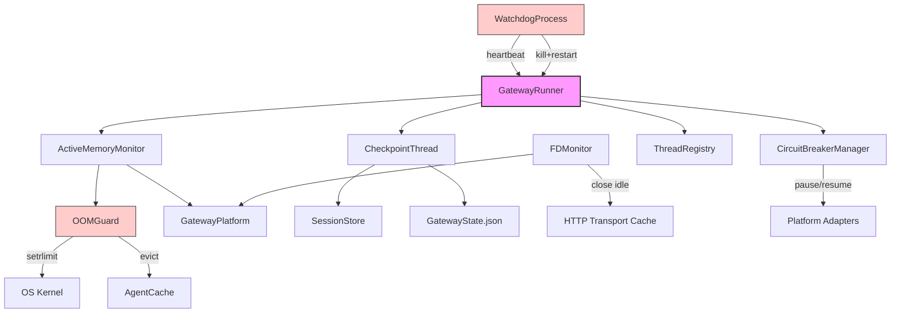

# Gateway Self-Healing & Resilience Layer — Architecture Design

**Author:** Rúnhild Svartdóttir (Architect, INTJ 5w6)  
**Date:** 2026-05-16  
**Status:** Design Phase — No Implementation  
**Target:** Hermes Agent gateway — `gateway/run.py`, `gateway/memory_monitor.py`, `gateway/session.py`

---

## Table of Contents

1. [Motivation & Current State Assessment](#1-motivation--current-state-assessment)
2. [System 1: OOM Guard & Memory Pressure Response](#2-system-1-oom-guard--memory-pressure-response)
3. [System 2: Dead Man's Switch (External Watchdog)](#3-system-2-dead-mans-switch-external-watchdog)
4. [System 3: Proactive State Persistence (Crash Recovery)](#4-system-3-proactive-state-persistence-crash-recovery)
5. [System 4: Resource Leak Detection (FD, Threads, Connections)](#5-system-4-resource-leak-detection-fd-threads-connections)
6. [System 6: Circuit Breaker with Auto-Recovery](#6-system-6-circuit-breaker-with-auto-recovery)
7. [Integration Map & Migration Sequence](#7-integration-map--migration-sequence)
8. [Component Architecture (Mermaid)](#8-component-architecture-mermaid)
9. [Risk Register](#9-risk-register)

---

## 1. Motivation & Current State Assessment

### 1.1 The Problem

The gateway is a reactive-patched monolith. It detects failures but does not prevent them. It observes resource pressure but takes no action. It receives SIGKILL (OOM, systemd timeout escalation) and leaves no trace.

**Known fatal gaps:**

| Gap | Audit ID | Current Behavior | Desired Behavior |
|-----|----------|------------------|------------------|
| OOM | P0-07 | Kernel SIGKILL → total state loss | Graceful degradation before kill |
| Memory pressure | P0-19 | Log `"rss=520MB"`, do nothing | Evict caches, force GC, warn users |
| Dead man's switch | P1-14 | None — hung gateway stays hung | External process detects hang → restart |
| Crash recovery | P1-09 | `.clean_shutdown` only on SIGTERM | Periodic snapshot → <30s data loss |
| FD leaks | P0-20 | Documented, not monitored | Runtime FD count check → proactive close |
| Sub-process health | P2-16 | Cron ticker dies silently | Thread health pings → alert/restart |
| Circuit breaker | P1-12, P1-05 | Manual pause only (permanent) | Auto half-open → auto-recovery |

### 1.2 Guiding Principles

1. **Fail gracefully, not catastrophically.** Every failure path should degrade service rather than terminate the process.
2. **Self-heal without operator intervention.** Manual `/platform resume` or `hermes gateway restart` should be rare.
3. **Cross-platform by design.** All health probes must work on Linux, macOS, and Windows through the `GatewayPlatform` abstraction (see `ME_GATEWAY_ARCH_CROSSPLATFORM.md`).
4. **Observability is not optional.** Every self-healing action must emit a structured log event.
5. **Zero-downtime recovery where possible.** State snapshots, agent cache eviction, and platform retry should not require restart.

---

## 2. System 1: OOM Guard & Memory Pressure Response

### 2.1 Problem Statement

The gateway peaks at 520MB RSS on a 1GB Pi. The kernel OOM killer sends SIGKILL with no handler possible. All in-progress agent conversations are lost.

### 2.2 Design

#### Layer 1: RLIMIT_AS (Linux/macOS) / Job Object (Windows)

Set a soft memory limit at **80% of available system RAM** via `resource.setrlimit(RLIMIT_AS)` on POSIX. On Windows, use `ctypes.windll.kernel32.SetProcessWorkingSetSize` as a soft advisory.

- When the limit is approached, Python raises `MemoryError` inside the gateway — catchable.
- This is a **soft guard**, not a hard wall. The kernel may still OOM-kill if other processes consume RAM.

#### Layer 2: Active Memory Monitor

Promote `gateway/memory_monitor.py` from observational to **active**:

```python
class ActiveMemoryMonitor:
    thresholds = {
        "warning":  0.65,   # 65% of system RAM
        "critical": 0.80,   # 80% — begin eviction
        "emergency": 0.90,  # 90% — suspend all non-essential work
    }

    async def on_threshold_crossed(level: str):
        if level == "critical":
            await evict_idle_agent_cache(target_ratio=0.5)
            gc.collect()
            await prune_mcp_connections(keep_recent=3)
            await notify_admins("Memory critical — caches evicted")
        elif level == "emergency":
            await suspend_all_non_essential_platforms()
            await persist_all_active_sessions()
            await notify_admins("Memory emergency — only core platforms active")
```

**Eviction policy:** LRU from `_agent_cache`, then tool schema cache, then MCP server pool.

#### Layer 3: Pre-Shutdown State Flush

On crossing emergency threshold, trigger `EmergencyPersistence.flush()`:
- Serialize all in-memory sessions to JSONL within 5 seconds.
- Mark sessions with `resume_pending = true`.
- This ensures even if SIGKILL follows seconds later, the loss window is <5s.

### 2.3 Cross-Platform Notes

| Platform | Memory Query | Limit Setting |
|----------|-------------|---------------|
| Linux | `/proc/self/status` VmRSS, `psutil` fallback | `resource.setrlimit` |
| macOS | `psutil.Process().memory_info().rss` | `resource.setrlimit` |
| Windows | `psutil.Process().memory_info().rss` | `ctypes.windll.kernel32` advisory |

---

## 3. System 2: Dead Man's Switch (External Watchdog)

### 3.1 Problem Statement

If the asyncio event loop hangs (blocking sync call, deadlocked thread), the gateway appears alive to systemd but does not process messages. No automatic recovery occurs.

### 3.2 Design

#### Architecture

An **external lightweight watchdog process** (`gateway/watchdog.py`) that is spawned by the gateway on startup and runs as a sibling process (not a child, to survive gateway crashes).

```
Gateway Process                    Watchdog Process
      |                                  |
   [asyncio]  <-- heartbeat (UDP/PIPE) -->  [timer]
   every 10s                              every 10s
      |                                  |
   send "pulse:<pid>:<timestamp>"      check "pulse" age
      |                                  |
   if pulse age > 30s:                   kill -9 <pid>, then
   execv gateway restart                 (or systemd restart)
```

#### Heartbeat Protocol

- **Transport:** Unix domain socket on Linux (`/tmp/hermes-<hash>.sock`), named pipe on Windows, regular file on macOS.
- **Message:** JSON `{"pid": int, "ts": float, "session_count": int, "platform_count": int}`
- **Interval:** 10 seconds.
- **Timeout:** 30 seconds (3 missed heartbeats).

#### Watchdog Actions on Timeout

1. **Confirm hang:** Send `SIGTERM` and wait 5s. If process still alive:
2. **Escalate:** Send `SIGKILL` (Linux/macOS) / `TerminateProcess` (Windows).
3. **Restart:** Spawn `sys.executable -m hermes gateway start` with same env.
4. **Alert:** Write to `gateway_state.json` with `last_action: "watchdog_kill"`.

#### Integration with systemd

If systemd is detected, the watchdog calls `systemctl --user restart hermes-gateway` instead of direct exec. This preserves systemd's restart counters and logging.

### 3.3 Cross-Platform Notes

| Platform | IPC | Kill | Restart |
|----------|-----|------|---------|
| Linux | Unix socket | `os.kill(pid, SIGKILL)` | `systemctl` or direct exec |
| macOS | Unix socket | `os.kill(pid, SIGKILL)` | `launchctl` or direct exec |
| Windows | Named pipe | `ctypes.windll.kernel32.TerminateProcess` | `subprocess.Popen` with `creationflags=subprocess.CREATE_NEW_PROCESS_GROUP` |

---

## 4. System 3: Proactive State Persistence (Crash Recovery)

### 4.1 Problem Statement

The `.clean_shutdown` sentinel only writes on graceful SIGTERM. SIGKILL (OOM, watchdog, systemd escalation) leaves no recovery hint. Sessions modified since last save are lost.

### 4.2 Design

#### Checkpoint Thread

A background thread (`_checkpoint_thread`) writes a lightweight checkpoint every **30 seconds** during active agent turns:

```python
class SessionCheckpoint:
    interval_sec: int = 30
    path: Path = HERMES_HOME / "checkpoints" / "gateway-session-checkpoint.jsonl"

    def checkpoint(self):
        # Only sessions with activity since last checkpoint
        dirty = [s for s in sessions if s.last_modified > self.last_checkpoint]
        with atomic_write(self.path) as f:
            for session in dirty:
                f.write(json.dumps(session.to_snapshot()) + "\n")
        self.last_checkpoint = time.time()
```

**Atomic write:** Write to `*.tmp`, then `os.rename()` (cross-platform atomic on same filesystem).

#### Recovery on Startup

1. Read `gateway_state.json` — if `.clean_shutdown` exists → normal start.
2. If no `.clean_shutdown` but checkpoint exists → enter **recovery mode**:
   - Replay checkpoint JSONL into session store.
   - For each restored session: set `resume_pending = true`, add system prompt: *"[System recovered from unexpected restart — resuming previous task]"`.
   - Notify the user via their platform that recovery occurred.
3. If checkpoint is >5 minutes old → warn that some context may be lost.

#### Cleanup

On clean shutdown, delete the checkpoint file. On startup after recovery, archive it to `checkpoints/archive/<timestamp>.jsonl`.

---

## 5. System 4: Resource Leak Detection (FD, Threads, Connections)

### 5.1 Problem Statement

Documented FD leaks on macOS (256 FD limit). No runtime monitoring. Cron ticker and memory monitor threads can die silently.

### 5.2 Design

#### FD Monitor

```python
class FDMonitor:
    warning_threshold: float = 0.70   # 70% of RLIMIT_NOFILE
    critical_threshold: float = 0.85 # 85%

    def check(self) -> Optional[Alert]:
        count = self.platform.count_open_fds()  # /proc/self/fd or psutil
        limit = self.platform.get_fd_limit()      # getrlimit or psutil
        ratio = count / limit
        if ratio > self.critical_threshold:
            return Alert.critical(f"FD usage {count}/{limit}")
```

**Remediation on critical:**
1. Close idle HTTP transports in agent cache.
2. Force-close MCP server subprocess stdin/stdout if idle >5 min.
3. Emit `FD_LEAK_CRITICAL` alert to admin channels.

#### Thread Health Monitor

Every background thread (cron ticker, memory monitor, checkpoint) must register with `ThreadRegistry`:

```python
class ThreadRegistry:
    def register(self, name: str, thread: Thread, heartbeat_interval: int):
        self.threads[name] = {"thread": thread, "last_beat": time.time(), ...}

    def check_health(self):
        for name, meta in self.threads.items():
            if time.time() - meta["last_beat"] > 3 * meta["heartbeat_interval"]:
                logger.critical(f"Thread {name} dead — restarting")
                self.restart_thread(name)
```

Each thread calls `thread_registry.ping(name)` in its main loop.

---

## 6. System 6: Circuit Breaker with Auto-Recovery

### 6.1 Problem Statement

Platform reconnection uses a manual pause (`_PAUSE_AFTER_FAILURES = 10`) with no auto-resume. A 6-minute DNS outage permanently disables a platform until operator intervention.

### 6.2 Design

#### State Machine

```
CLOSED  --(10 failures)-->  OPEN  --(60s timeout)-->  HALF_OPEN
   ^                            |                          |
   |                            | (1 success)              | (1 failure)
   +--(next failure)------------+                          +---> OPEN
```

- **CLOSED:** Normal operation. Count consecutive failures.
- **OPEN:** Stop trying. Set `paused = true`. Start recovery timer (60s base, capped at 300s).
- **HALF_OPEN:** Allow exactly 1 test connection. On success → CLOSED. On failure → OPEN with doubled recovery timer.

#### Integration

Replace `_retry_failed_platforms()` in `GatewayRunner` with `CircuitBreakerManager`:

```python
class CircuitBreakerManager:
    breakers: Dict[str, CircuitBreaker]  # key = platform_id

    async def on_platform_failure(self, platform_id: str, exc: Exception):
        breaker = self.breakers[platform_id]
        state = breaker.record_failure()
        if state == State.OPEN:
            await self.gateway.pause_platform(platform_id, auto=True)
            asyncio.create_task(self._schedule_recovery(platform_id))

    async def _schedule_recovery(self, platform_id: str):
        await asyncio.sleep(self.breakers[platform_id].recovery_delay)
        await self.gateway.attempt_platform_reconnect(platform_id)  # HALF_OPEN test
```

**Auto vs Manual Pause:**
- `paused = auto` → circuit breaker triggered, will self-recover.
- `paused = manual` → user ran `/platform pause`, stays paused until `/platform resume`.

---

## 7. Integration Map & Migration Sequence

### 7.1 New Modules

| Module | Responsibility | Depends On |
|--------|---------------|------------|
| `gateway/resilience/oom_guard.py` | RLIMIT_AS, memory threshold actions | `GatewayPlatform` |
| `gateway/resilience/watchdog.py` | External heartbeat + restart | `GatewayPlatform` |
| `gateway/resilience/checkpoint.py` | 30s state snapshots, recovery | `session.py` |
| `gateway/resilience/fd_monitor.py` | FD + thread health checks | `GatewayPlatform` |
| `gateway/resilience/circuit_breaker.py` | Per-platform state machine | `GatewayRunner` |
| `gateway/resilience/coordinator.py` | Orchestrates all resilience systems | All above |

### 7.2 Migration Sequence

**Phase 1 (Low Risk):**
1. Create `gateway/resilience/` package.
2. Implement `CircuitBreaker` — pure logic, no gateway integration yet.
3. Implement `ThreadRegistry` — register existing threads, no restart logic yet.

**Phase 2 (Medium Risk):**
4. Wire `CircuitBreakerManager` into `_retry_failed_platforms()`.
5. Replace manual pause with auto-pause + recovery.
6. Implement `Checkpoint` thread — write only, no recovery read yet.

**Phase 3 (Higher Risk):**
7. Implement `OOMGuard` — set RLIMIT_AS, add memory threshold handlers.
8. Implement `Watchdog` process — spawn from gateway, verify heartbeat.
9. Add FD monitor to cron ticker loop.

**Phase 4 (Validation):**
10. Enable checkpoint recovery on startup.
11. Simulate OOM with `ulimit -v` in CI.
12. Simulate thread death (inject `sys.exit` in ticker) and verify detection.

---

## 8. Component Architecture (Mermaid)



---

## 9. Risk Register

| ID | Risk | Likelihood | Impact | Mitigation |
|----|------|------------|--------|------------|
| R1 | Watchdog kills healthy gateway (false positive) | Low | High | 3-strike heartbeat, SIGTERM test before SIGKILL |
| R2 | Checkpoint I/O saturates SD card on Pi | Medium | Medium | 30s interval, only dirty sessions, atomic writes |
| R3 | OOM guard triggers too late (MemoryError after limit) | Medium | High | Set limit at 80%, not 95%; multiple layers |
| R4 | Circuit breaker oscillates (flapping) | Medium | Medium | Exponential backoff on recovery timer, max 300s |
| R5 | Thread restart causes state corruption | Low | High | Restart only the thread's entrypoint, not shared state |
| R6 | Cross-platform limit APIs differ silently | Medium | Medium | Abstract through `GatewayPlatform`; unit tests per OS |
